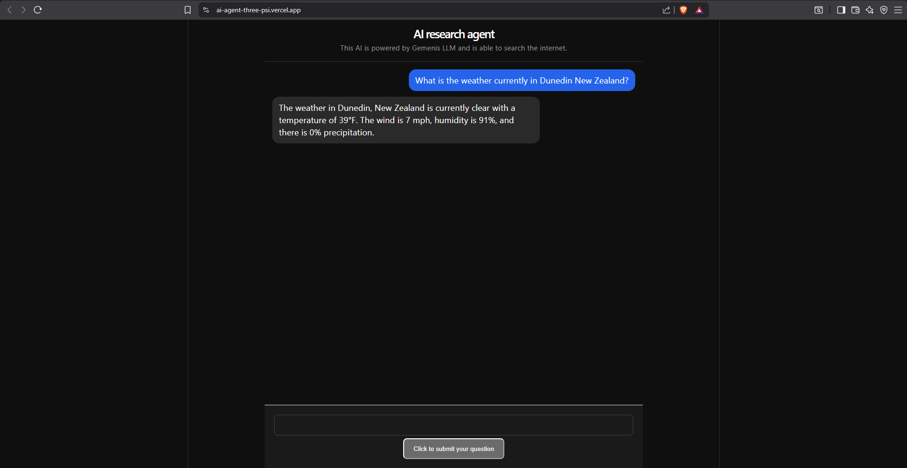

# AI Research Agent

A web application powered by Google Gemini LLM and a LangGraph ReAct agent 
that decides when to search the web using SerpAPI, returning up to date answers 
via a chat interface.

🔗 [Live Demo](https://ai-agent-three-psi.vercel.app/)



## Tech Stack
- **Frontend:** React, TypeScript, Vite, deployed on Vercel
- **Backend:** Python, FastAPI, LangChain, LangGraph, SerpAPI, deployed on Render
- **AI:** Google Gemini API (gemini-2.5-flash)

## Running Locally

### Prerequisites
- Node.js 18+ (for frontend)
- Python 3.12+ (for backend)
- A free Gemini API key from [Google AI Studio](https://aistudio.google.com)
- A free SerpAPI key from [serpapi.com](https://serpapi.com)

### Backend
```bash
cd backend
pip install -r requirements.txt
# create a .env file with GEMINI_API_KEY and SERPAPI_API_KEY
python main.py
```

### Frontend
```bash
cd frontend
npm install
# create a .env file with VITE_API_URL=http://localhost:8000
npm run dev
```

## What I Learned

In this project I learned how LangGraph manages the ReAct reasoning loop as a state machine. It allows the LLM to search the internet using SerpAPI and find updated information until it reaches a viable answer. This taugh me a valuable lesson about how LLM's without search tools will confidently give incorrect answers. I gained a deeper understanding of Python and FastAPI which are similar to Node.js just with Python syntax.